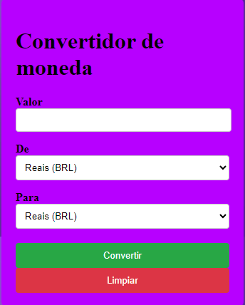
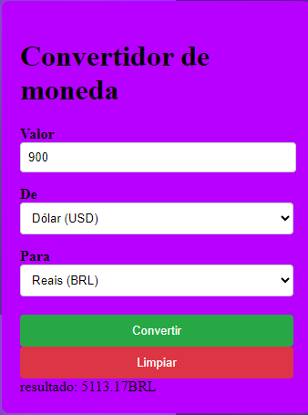

# conversor de moeda API

 


Esta é uma API de conversão de moeda simples e eficiente que permite converter valores entre diferentes moedas em tempo real usando dados atualizados.

# Funcionalidades

 * ## conversão de moeda: coverter o valoe de uma moeda para outra 

 * ## Taxas de Câmbio em Tempo Real: Utilize taxas de câmbio atualizadas para garantir precisão.

* ## Suporte a Diversas Moedas: Suporte para várias moedas populares ao redor do mundo.

# TECNOLOGIAS 

*  ## HTML(Estructura do codigo);

* ## javaScript(codigo para realizar as funções);

* ## CSS(estilização do codigo);  

## instalação

clone o repositorio:
 
 ```
 https://github.com/32leo/conversor-de-moeda-API

 ```

 instale o visual estudo code:
 ```
 https://code.visualstudio.com/
 ```

 copie o codigo:
 ```
 const apiKey = '750e5cbab3fc2522ab79b19c';
const apiURL = ` https://v6.exchangerate-api.com/v6/${apiKey}/latest/`;


// função apara consulta de taxa de cambio de API
// -----------------------------------------------------------------------------------------------------------------------------------------
async function getExchangeRate(daMoeda, paraMoeda) {
    try {
        const response = await fetch(`${apiURL}${daMoeda}`);
        const data = await response.json();

        if (data.result === "success") {
            return data.conversion_rates[paraMoeda];

        } else {
            throw new error('erro ao buscar taxa de cambio');
        }

    } catch (error) {
        console.error("erro:", error);
        return null;
    }

}
//------------------------------------------------------------------------------------------------------------------------------------------
//
document.getElementById('currency-form').addEventListener('submit', async function (event) {
    event.preventDefault();

    // Obter valoresde entrada
    const valor = parseFloat(document.getElementById('valor').value);
    const daMoeda = document.getElementById('daMoeda').value;
    const paraMoeda = document.getElementById('paraMoeda').value;

    const getExgaente = await getExchangeRate(daMoeda, paraMoeda);


    if (getExgaente) {
        const converterValue = valor * getExgaente;

        // console.log
        const conversao = document.getElementById('conversao');
        conversao.textContent = `resultado: ${converterValue.toFixed(2)}${paraMoeda}`
    } else {
        alert('Erro ao buscar o cotação. Tente novamente')
    }
});
 ```

 a estrutura do codigo:
 ```
 <!DOCTYPE html>
<html lang="pt-BR">
<head>
    <meta charset="utf-8" />
    <meta http-equiv="X-UA-Compatible" content="IE=edge" />
    <title>Conversor De Moedas</title>
    <meta name="viewport" content="width=device-width, initial-scale=1" />
    <link rel="stylesheet" type="text/css" href="API.css" />
</head>
<body>
    <div id="form">
        <h1 style=>Convertidor de moneda</h1>
        <div id="input-box">
            <form id="currency-form">
                <div id="texts">
                    <label for="valor">Valor</label>
                    <input required type="number" id="valor" />
                </div>
                <div id="texts">
                    <label for="Damoeda">De</label>
                    <select id="daMoeda">
                        <option value="BRL">Reais (BRL)</option>
                        <option value="USD">Dólar (USD)</option>
                        <option value="EUR">Euros (EUR)</option>
                    </select>
                </div>
                <div id="texts">
                    <label for="Paramoeda">Para</label>
                    <select id="paraMoeda">
                        <option value="BRL">Reais (BRL)</option>
                        <option value="USD">Dólar (USD)</option>
                        <option value="EUR">Euros (EUR)</option>
                    </select>
                </div>
                <h2 id="Resultado"></h2>
                <div id="button-continue">
                    <button type="submit">Convertir</button>
                </div>
                <div id="limpar">
                    <button type="button" onclick="document.getElementById('valor').value=''">Limpiar</button>
                </div>
                <div id="conversao"></div>
            </form>
        </div>
    </div>
 
    <script src="API.js"></script>
</body>
</html>
```

## a esrtilização do codigo e do seu criterio.

# Tratamento de Erros

Caso a API de taxas de câmbio externa esteja indisponível ou algum parâmetro esteja incorreto, a API retornará uma mensagem de erro detalhada.